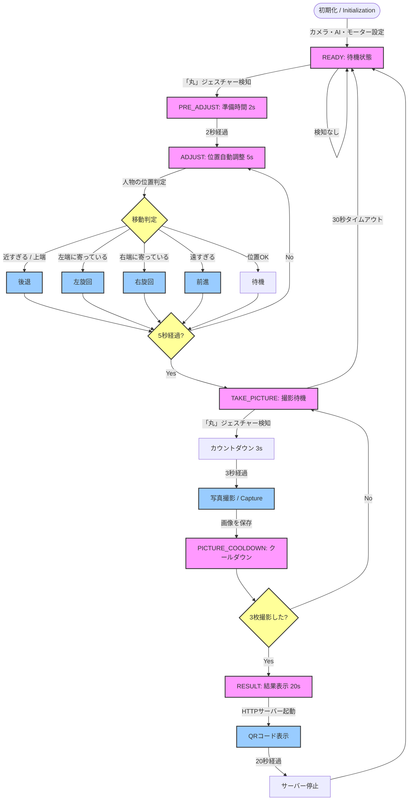

# システムフローチャート (System Flowchart)

このドキュメントは、Auto-Shutterシステムの動作ロジックをMermaid形式で視覚化したものです。

## 状態遷移図

## 各フェーズの説明

1.  **READY**: ユーザーがカメラの前で「丸」のポーズをするのを待機します。
2.  **PRE_ADJUST**: ポーズ検知後、ユーザーが手を下ろして自然な姿勢になるための猶予時間です。
3.  **ADJUST**: MediaPipeを使用して人物のバウンディングボックスを解析し、適切な構図になるようロボットが物理的に移動します。
4.  **TAKE_PICTURE**: 再度「丸」のポーズをすることで撮影を開始します。
5.  **RESULT**: 撮影した画像を共有するためのQRコードを生成・表示します。
